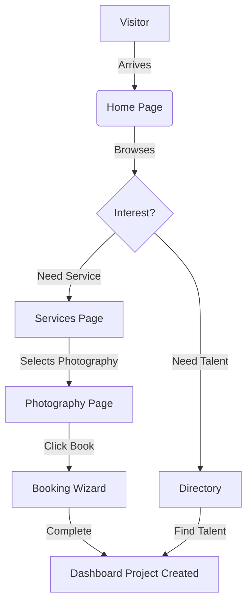
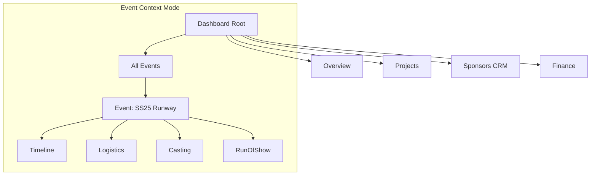

# FashionOS 2.0 Sitemap

## 🗺️ Core Navigation Structure

### Public Website
*   **Home** (`/`) - Landing page with brand value proposition.
*   **About Us** (`/about`) - Company history and mission.
*   **Services** (`/services`) - Service overview.
    *   **Photography Services** (`/services/photography`) - Premium editorial service page.
    *   *Video Production* (Planned)
    *   *Web Design* (Planned)
    *   *Ecommerce Strategy* (Planned)
*   **Directory** (`/directory`) - Talent search (Models, Photographers, Stylists).
*   **Events** (`/events`) - Public event calendar.
*   **Marketplace** (`/marketplace`) - Package purchasing (Starter, Campaign, Enterprise).
*   **Booking Wizard** (`/start-project`) - Multi-step booking flow.
*   **Contact** (`/contact`) - Inquiry form.
*   **Login / Sign Up** (`/dashboard`) - Access to private dashboard.

### Dashboard (Private)
*   **Overview** (`/dashboard`) - Command center, recent activity, stats.
*   **Projects** (`/dashboard/projects`) - Active production list.
*   **Events** (`/dashboard/events`) - Event management hub.
    *   **Event Context** (`/dashboard/events/:id`)
        *   Command Center
        *   Timeline (`/dashboard/events/:id/timeline`)
        *   Logistics (`/dashboard/events/:id/logistics`)
        *   Sponsors (`/dashboard/events/:id/sponsors`)
        *   Casting (`/dashboard/events/:id/casting`)
*   **Services** (`/dashboard/services`) - Subscription and service management.
*   **Sponsors** (`/dashboard/sponsors`) - CRM for brand partnerships.
*   **Finance** (`/dashboard/finance`) - Invoices and payments.

---

## 📊 Visual Architecture

### 1. User Journey Flow

### 2. Dashboard Information Architecture
